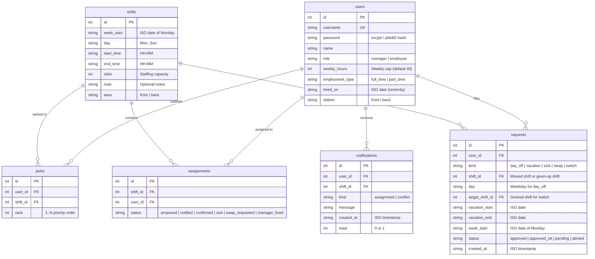
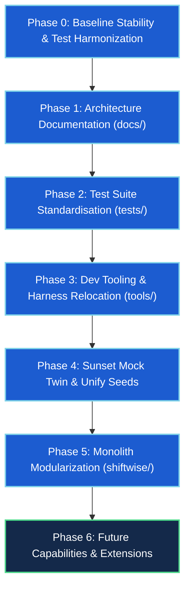

# ShiftWise Suite — Master Architecture & Reorganization Plan

> **Status:** Active / Approved Master Plan  
> **Date:** September 2026  
> **Repository:** `clain1016/shiftwise-suite` (`master`)  
> **Replaces:** Legacy *ShiftWise Suite reorganization plan.md* (incorporating verified codebase audit and post-merge architectural analysis)

---

## 1. Executive Summary & Context

Over the past several days, multiple critical feature branches and architectural milestones converged into `master`:
1. **Front-of-House / Back-of-House (FOH/BOH) House Split:** Segregated staffing stations, dual-house shift scheduling, house-constrained picks, and conflict isolation.
2. **Production Containerization Stack:** Gunicorn WSGI runner behind a Caddy reverse proxy providing automatic TLS, security headers, health probes, and Docker Compose orchestration.
3. **Authentication & Data Hardening:** Secure password hashing via `werkzeug.security` (scrypt), enforced 12+ character manager bootstrap passwords, session cookie hardening (`HttpOnly`, `SameSite=Lax`, configurable `Secure`), and isolated test databases.
4. **Manager Manual Assignment Overrides:** Sticky `manager_fixed` assignment statuses that survive automatic schedule recomputations, alongside responsive mobile navigation.
5. **LAN Binding for Mock Demonstrations:** Configurable listener support (`0.0.0.0:5001`) enabling multi-device local network evaluations.

While the application is functional and resilient, rapid feature merging has left the codebase in a tangled, dual-state structure. Core scheduling logic is duplicated across an unwieldy `shiftwise-mock/` "twin," test files are scattered at the root with divergent test patterns, seed data is defined three separate ways, and the entire production backend resides inside a single 1,637-line monolith (`app.py`).

This document provides a comprehensive **audit of the codebase's current state**, defines the **domain and technical architecture**, and presents an **actionable 6-phase roadmap** to transition ShiftWise into a clean, maintainable, modular, and fully tested production suite.

---

## 2. Codebase Ground-Truth Audit

### 2.1 File Inventory & Component Classification

The repository currently consists of **45 core tracked files** (excluding git metadata and virtual environments):

| Category | Files | Line Count (Approx) | Role & Observations |
|---|---|---|---|
| **Core Monolith** | `app.py` | 1,637 lines | Schema DDL, migrations, SQLite connection management, auth, scheduling engine, coverage planning, and 24 Flask route handlers in one file. |
| **Templates** | `templates/*.html` (9 files) | 793 lines total | Jinja2 templates (`base.html`, `dashboard.html`, `manager.html`, `conflicts.html`, `requests.html`, `roster.html`, `calendar.html`, `login.html`, `password.html`). Responsive CSS embedded in `base.html`. |
| **Root Tests** | `test_*.py` (12 test suites + `test_support.py`) | ~2,100 lines total | 10 script-style test files with module-level assertions, 2 `unittest.TestCase` files (`test_container.py`, `test_review_fixes.py`), and `test_support.py` (temporary DB isolation helper). |
| **Mock Twin** | `shiftwise-mock/app.py`, `shiftwise-mock/templates/*.html` | 2,430 lines total | Exact duplicate of `app.py` (differing by only 2 lines for host/port defaults) and duplicate copy of `templates/`. Synchronized via `sync.sh`. |
| **Mock Seed & Harnesses** | `shiftwise-mock/{mock_seed.py, gauntlet.py, scenario_demo.py, scenario_random.py, test_mock.py, test_lan_bind.py}` | ~1,600 lines total | Rich end-to-end chaos tests, randomized house-flip simulations, and mock tests. Still trapped inside `shiftwise-mock/` instead of shared developer tooling. |
| **Root Seed Data** | `mock_seed.py` | 102 lines | Divergent, outdated 8-employee seed without FOH/BOH house tags (conflicts with `shiftwise-mock/mock_seed.py` and Docker entrypoint). |
| **Deployment** | `Dockerfile`, `docker-compose.yml`, `Caddyfile`, `docker-entrypoint.sh`, `.env.example`, `.dockerignore` | ~250 lines total | Production Gunicorn + Caddy setup. Hardened proxy handling and healthcheck endpoints. |
| **Dependencies** | `requirements.txt` | 3 lines | Lists only `Flask>=3.0,<4` and `gunicorn>=22.0.0`. Missing developer/test dependencies (e.g., `pytest`). |
| **Documentation** | `README.md` | 87 lines | Operational instructions only; lacks system architecture, domain invariants, and API documentation. |

---

### 2.2 Critical Structural Smells & Technical Debt

#### 1. The Triple Seeding Divergence
The repository contains **three conflicting versions** of seed data:
- **`app.py` internal seed (`init_db(seed_demo=True)`):** Hardcoded 6 employees (Alex, Sam, Taylor in Front; Jordan, Casey, Morgan in Back) and 14 shifts.
- **Root `mock_seed.py`:** Legacy 8-employee roster (Maria, Devon, Priya, Alex, Sam, Jordan, Taylor, Riley) with **no FOH/BOH stations** and 7 shifts. Used by `test_container.py` and `docker-entrypoint.sh`.
- **`shiftwise-mock/mock_seed.py`:** Modern 10-employee roster (5 Front / 5 Back) with 14 shifts and pre-ranked 7-day preferences.
- *Impact:* `docker-entrypoint.sh` calls `app.init_db(mock_roster=True)`, which invokes root `mock_seed.py` and seeds a broken, pre-FOH/BOH database into container deployments. Meanwhile, `test_container.py` hard-asserts that `employee_count == 8` and `shift_count == 7`, blocking standard harmonization.

#### 2. The Mock Twin & `sync.sh` Duplication Anti-Pattern
- `shiftwise-mock/app.py` is committed to git. It is 1,637 lines long and differs from the root `app.py` by exactly two lines:
  ```python
  # root app.py:
  app.run(host=os.environ.get("SHIFTWISE_HOST", "127.0.0.1"), port=int(os.environ.get("SHIFTWISE_PORT", "5000")), debug=False)
  # shiftwise-mock/app.py:
  app.run(host=os.environ.get("SHIFTWISE_HOST", "0.0.0.0"), port=int(os.environ.get("SHIFTWISE_PORT", "5001")), debug=False)
  ```
- Because `app.py` already checks environment variables `SHIFTWISE_HOST` and `SHIFTWISE_PORT`, creating a separate file via string replacement in `sync.sh` is unnecessary technical debt.
- All 9 HTML templates in `shiftwise-mock/templates/` are identical duplicates of `templates/`.
- Every feature change requires running `sync.sh` and committing thousands of redundant lines of code.

#### 3. Test Runner Disconnect & Import-Time Execution
- **Pytest collection failure:** Running `pytest` discovers `shiftwise-mock/test_lan_bind.py`, which executes socket connection tests and launches a background server subprocess at module import time.
- If `shiftwise-mock/scheduler.db` is empty (as it was when committed at 0 bytes), `test_lan_bind.py` immediately crashes or hangs on import.
- 10 of the root `test_*.py` files are procedural scripts with assertions at top-level instead of standard test functions (`def test_*`) or `unittest.TestCase`. While they pass when executed sequentially with `python <file>.py`, standard test runners cannot manage their lifecycle, isolation, or parallelization cleanly.

#### 4. Monolithic Density of `app.py`
`app.py` contains 24 routes and 36 functions with no layer separation:
- Database connection, WAL mode initialization, and manual DDL schema migrations (checking `PRAGMA table_info`).
- Password migration, session cookies, and reverse proxy middleware.
- Core scheduling engine (`run_scheduler`, 268 lines).
- Absence and coverage planning algorithms (`coverage_plan`, `apply_sick`).
- All web routing: Auth, Employee Self-Service, Manager Operations, Conflicts, and Rostering.

#### 5. Developer Harnesses Trapped in Mock Directory
`gauntlet.py`, `scenario_demo.py`, and `scenario_random.py` are end-to-end integration and chaos simulation harnesses that exercise the real scheduling engine, yet they reside exclusively in `shiftwise-mock/`. Furthermore, `scenario_random.py` still contains hardcoded legacy path references (e.g., `/home/cody/scheduler/...`).

---

## 3. Architecture & Domain Specification

To ensure future refactoring preserves domain integrity, the system's operational model is documented below.

### 3.1 Data Model (SQLite Schema)

ShiftWise operates on 6 relational tables managed with SQLite WAL mode and foreign keys enabled:



### 3.2 Core Domain Invariants

1. **FOH/BOH Station Boundary:**
   - Employees belong to a `station` (`front` or `back`).
   - Shifts belong to an `area` (`front` or `back`).
   - Staff can *only* pick, be assigned to, switch into, or cover shifts in their own station (`users.station == shifts.area`). No cross-house scheduling is ever permitted.

2. **Priority Lineup Hierarchy:**
   Contested shift allocations are resolved using `priority_key`:
   $$\text{Priority} = (\text{station}: \text{front} < \text{back}, \ \text{type}: \text{full\_time} < \text{part\_time}, \ -\text{seniority\_days})$$
   - Full-time staff always take precedence over part-time staff within their station.
   - Within the same employment type, earlier hire dates (seniority) prevail.

3. **Scheduling Caps & Constraints:**
   - **Hours Cap:** $\sum \text{shift\_hours} \le \text{weekly\_hours}$ (default 40h for FT, custom for PT).
   - **Days-Off Rule:** Every employee must receive at least 2 days off per week (`MIN_DAYS_OFF = 2`; max 5 working days per week). A double shift on the same day counts as 1 working day.
   - **Overlap Prevention:** An employee cannot hold two shifts that overlap in time on the same day.

4. **Assignment Lifecycle & Rebuild Semantics:**
   - During `run_scheduler(week_start)`:
     - Prior auto-generated assignments (`proposed`, `notified`) are wiped and re-computed from picks.
     - `manager_fixed` (manual overrides) and `confirmed` assignments **survive unchanged**.
     - `sick` and `swap_requested` rows leave slots open for backfilling or coverage.

5. **Request Workflows:**
   - `sick`: Employee marks sick $\rightarrow$ assignment status becomes `sick` $\rightarrow$ `coverage_plan` searches for valid coverers (unfilled pickers first by priority, then least-loaded available employee) $\rightarrow$ coverer assigned `notified` status.
   - `swap`: Employee gives up shift $\rightarrow$ status becomes `swap_requested` $\rightarrow$ if cover found, old assignment is removed and coverer assigned.
   - `day_off` / `vacation`: Dropped shifts are removed from assignments; schedule recomputes.
   - `switch`: Manager reviews request; approved only if target shift has available capacity and rules are satisfied.

---

## 4. Master Reorganization & Modernization Roadmap

The following 6-phase master plan outlines the step-by-step modernization.



---

### Phase 0: Baseline Stability & Test Harmonization (Immediate)
*Goal: Fix test-discovery traps and configuration leaks with zero logic changes.*

1. **Fix `test_lan_bind.py` Top-Level Execution:**
   - Wrap top-level socket checks and subprocess execution inside `if __name__ == "__main__":` or a formal test class/function.
   - Guard against missing or zero-byte mock databases by using a dynamic temporary database fixture with fallback seeding.
2. **Add Missing Developer Requirements:**
   - Create `requirements-dev.txt` containing `pytest>=8.0.0`.
   - Update `requirements.txt` / docs to clarify production vs development dependencies.
3. **Purge Legacy Hardcoded Paths:**
   - Replace `/home/cody/scheduler/...` in `scenario_random.py` with dynamic `Path(__file__)` references.
4. **Verification Gate:**
   - Run `pytest` at the root directory: all discoverable tests run and complete with zero hangs or unhandled import errors.

---

### Phase 1: Canonical Documentation Architecture (`docs/`)
*Goal: Provide authoritative reference documentation for developers and operators.*

Create a structured `docs/` tree adhering to the verified status header standard:
```markdown
# Title
> Status: current · Last verified: 2026-09-29 (<commit-sha>)
```

| Document | Destination | Detailed Scope |
|---|---|---|
| **Architecture** | `docs/ARCHITECTURE.md` | Core components, request flow, coverage engine, priority sorting, rebuild mechanics. |
| **Data Model** | `docs/DATA_MODEL.md` | Complete SQLite table specifications, column types, foreign key constraints, FOH/BOH station rules. |
| **Development** | `docs/DEVELOPMENT.md` | Local setup, virtual environment, running tests, executing simulation harnesses. |
| **Deployment** | `docs/DEPLOYMENT.md` | Docker Compose orchestration, Gunicorn WSGI tuning, Caddy TLS/reverse proxy configuration, container health checks. |
| **Environment** | `docs/ENVIRONMENT.md` | Comprehensive reference of all `SHIFTWISE_*` environment variables, default values, and production recommendations. |
| **README Refresh** | `README.md` | Streamlined front-door documentation with quick-start steps and cross-references into `docs/`. |

*Verification Gate:* All links in documentation resolve; markdown formatting renders cleanly.

---

### Phase 2: Test Suite Reorganization (`tests/`)
*Goal: Move all root test scripts into a structured directory and adopt standardized test practices.*

1. **Directory Structure:**
   ```
   tests/
   ├── __init__.py
   ├── conftest.py              # Shared fixtures (temp DB, pre-seeded DB, test client)
   ├── test_support.py          # Legacy support compatibility
   ├── unit/                    # Pure logic & rule tests
   │   ├── test_days_off.py
   │   ├── test_priority.py
   │   ├── test_manager_pick.py
   │   └── test_calendar.py
   └── integration/             # Full request/route flows & deployment
       ├── test_flow.py
       ├── test_requests.py
       ├── test_conflicts.py
       ├── test_manager_override.py
       ├── test_preferred_schedule.py
       ├── test_rebuild_recompute.py
       ├── test_review_fixes.py
       └── test_container.py
   ```
2. **Encapsulation:**
   - Refactor script-style tests (which currently rely on module-level execution) into test functions (`def test_*`) or `unittest.TestCase` methods.
   - Utilize a standard `conftest.py` fixture for `isolate_database(appmod)` to eliminate duplicate setup/teardown boilerplate across test suites.
3. **Verification Gate:**
   - `pytest tests/` runs all tests cleanly with 100% pass rate.

---

### Phase 3: Developer Tools & Simulation Harnesses (`tools/`)
*Goal: Promote integration and chaos test harnesses to first-class developer tooling.*

1. **Extract Harnesses from `shiftwise-mock/`:**
   - Move `gauntlet.py`, `scenario_demo.py`, and `scenario_random.py` to a root `tools/` directory.
2. **Make Harnesses Environment-Configurable:**
   - Accept target database path, host, and port via CLI flags or `SHIFTWISE_DB_PATH`.
   - Allow running the full scenario suite against both local developer builds and remote demo instances.
3. **Provide Developer Runner Scripts:**
   - Create a single entry point `tools/run_all.sh` or `Makefile` target that executes:
     1. Unit and integration test suite (`pytest tests/`).
     2. Sequential scenario simulations (`scenario_demo.py`).
     3. Deterministic gauntlet verification (`gauntlet.py`).
4. **Verification Gate:**
   - All three simulation tools run green from `tools/`.

---

### Phase 4: Mock Twin Sunset & Seed Unification
*Goal: Eliminate 2,400+ lines of duplicated code and harmonize seed definitions.*

1. **Unify Seed Data (`seed.py` / `mock_seed.py`):**
   - Establish a single canonical seed implementation supporting the 10-employee (5 FOH, 5 BOH) roster and 14 shifts.
   - Update `test_container.py` and `docker-entrypoint.sh` to expect the canonical 10-employee seed rather than the legacy 8-employee dataset.
2. **Eliminate Duplicated `shiftwise-mock/app.py` & Templates:**
   - Replace `shiftwise-mock/app.py` and `shiftwise-mock/templates/` with a lightweight launcher script:
     ```python
     # tools/run_mock.py or shiftwise-mock/run.py
     import os
     from pathlib import Path
     import app

     if __name__ == "__main__":
         os.environ.setdefault("SHIFTWISE_HOST", "0.0.0.0")
         os.environ.setdefault("SHIFTWISE_PORT", "5001")
         os.environ.setdefault("SHIFTWISE_DB_PATH", str(Path(__file__).parent / "mock.db"))
         app.init_db(seed_demo=True)
         app.app.run(
             host=os.environ["SHIFTWISE_HOST"],
             port=int(os.environ["SHIFTWISE_PORT"]),
             debug=False
         )
     ```
   - Retire `sync.sh` completely; no source code or templates are ever copied.
   - Update `shiftwise-mock/test_mock.py` and `test_lan_bind.py` to target the launcher.
3. **Verification Gate:**
   - Full test suite passes; mock demo runs on port 5001 without redundant files in git.

---

### Phase 5: Modularizing the Monolith (`shiftwise/` Package)
*Goal: Decompose `app.py` into a clean, maintainable Python application package.*

Transform `app.py` into an organized package while preserving 100% backward compatibility with existing tests and deployment configurations:

```
shiftwise/
├── __init__.py           # Application factory: create_app()
├── config.py             # Environment configuration & secret handling
├── db.py                 # SQLite connection, DDL SCHEMA, migrations
├── domain/               # Core business logic & models
│   ├── __init__.py
│   ├── constants.py      # DAYS, MIN_DAYS_OFF, statuses
│   ├── models.py         # Shift, User, Assignment, Request objects / helpers
│   └── rules.py          # priority_key, shift_hours, assignment_block_reason
├── scheduler/            # Scheduling engine
│   ├── __init__.py
│   ├── engine.py         # run_scheduler()
│   └── coverage.py       # coverage_plan(), apply_sick()
├── notify.py             # Notification system (in-app messages)
└── routes/               # Modular Flask blueprints
    ├── __init__.py
    ├── auth.py           # /login, /logout, /account/password
    ├── employee.py       # /, /pick, /swap, /request/*
    ├── manager.py        # /manager, /manager/shift/*, /manager/requests/*
    ├── conflicts.py      # /manager/conflicts, /manager/assign, /manager/unassign
    ├── roster.py         # /manager/roster, /manager/roster/add
    └── calendar.py       # /calendar, /healthz
```

**Step-by-Step Refactoring Strategy (One Module per PR):**
1. **PR 5.1:** Extract `db.py` (connection, schema, migrations) and `config.py`.
2. **PR 5.2:** Extract `domain/rules.py` (`priority_key`, `shift_hours`, `assignment_block_reason`).
3. **PR 5.3:** Extract `scheduler/` (`run_scheduler`, `coverage_plan`, `apply_sick`).
4. **PR 5.4:** Extract routes into Blueprints (`auth`, `employee`, `manager`, `conflicts`, `roster`, `calendar`).
5. **PR 5.5:** Maintain top-level `app.py` as a lightweight compatibility shim importing `create_app()` so existing Gunicorn commands, Docker entrypoints, and tests remain intact.

*Verification Gate:* All unit, integration, container, and chaos tests remain 100% green after each extraction PR.

---

### Phase 6: Future Capabilities & Extensions (Post-Refactor)
*Goal: Build high-value features on top of the clean modular architecture.*

1. **Employee-to-Employee Shift Trade Board:**
   - Allow employees to post open shifts to a peer board; other qualified same-house employees can accept directly, auto-notifying the manager for one-click approval.
2. **External Notification Adapters:**
   - Abstract the `notify()` interface into pluggable backends (In-App SQLite, Email via SMTP/SendGrid, SMS via Twilio).
3. **iCalendar / Webcal Schedule Feeds:**
   - Provide signed subscriber URLs (`/schedule/<token>.ics`) so staff can sync published shifts to Google Calendar, Apple Calendar, or Outlook.
4. **Multi-Week Scheduling & Templates:**
   - Allow managers to save repeating shift templates and publish schedules 2–4 weeks in advance.

---

## 5. Development Invariants & Safety Guardrails

To prevent regressions and maintain developer velocity, every PR must adhere to the following rules:

1. **No Mixed PRs:**
   Never combine reorganization/file movements with behavior modifications in the same pull request. A move PR must be byte-for-byte behaviorally identical.
2. **URL & Route Stability:**
   HTTP URLs and query/form parameters are the public contract with the frontend templates and tests. Do not rename routes or alter form key expectations during refactoring.
3. **Database Schema Continuity:**
   Any change to SQLite column definitions or default values must include backward-compatible migration logic in `init_db()`.
4. **Verification Requirement:**
   Before opening or merging any PR:
   ```sh
   # 1. Run full test suite
   .venv/bin/pytest tests/   # (or procedural test runner prior to Phase 2)
   # 2. Run mock tests
   .venv/bin/python shiftwise-mock/test_mock.py
   # 3. Run gauntlet simulation
   .venv/bin/python shiftwise-mock/gauntlet.py
   ```

---

## 6. Actionable PR Execution Sequence

| PR # | Phase | Title | Scope & Artifacts | Primary Verification Command |
|---|---|---|---|---|
| **PR 1** | Phase 0 | **Fix Test Import Traps & Clean Paths** | Guard `test_lan_bind.py`, fix 0-byte db issue, remove `/home/cody` paths, add `requirements-dev.txt`. | `.venv/bin/pytest -v` |
| **PR 2** | Phase 1 | **Comprehensive Documentation Suite** | Add `docs/{ARCHITECTURE,DATA_MODEL,DEVELOPMENT,DEPLOYMENT,ENVIRONMENT}.md`, refresh `README.md`. | Dead-link check & markdown audit |
| **PR 3** | Phase 2 | **Test Suite Reorganization** | Move `test_*.py` into `tests/unit/` and `tests/integration/`, introduce `conftest.py`. | `.venv/bin/pytest tests/` |
| **PR 4** | Phase 3 | **Relocate Developer Harnesses** | Move `gauntlet.py` and `scenario_*.py` to `tools/`, provide unified `tools/run_all.sh`. | `bash tools/run_all.sh` |
| **PR 5** | Phase 4 | **Unify Seeds & Sunset Mock Twin** | Single 10-person seed, replace `shiftwise-mock/app.py` with launcher, remove duplicate templates & `sync.sh`. | Full test suite + container test |
| **PR 6** | Phase 5 | **Extract DB, Config & Domain Rules** | Create `shiftwise/db.py`, `shiftwise/config.py`, and `shiftwise/domain/rules.py`. | `pytest tests/` |
| **PR 7** | Phase 5 | **Extract Scheduling Engine** | Create `shiftwise/scheduler/engine.py` and `shiftwise/scheduler/coverage.py`. | `pytest tests/` + `tools/gauntlet.py` |
| **PR 8** | Phase 5 | **Decompose Routes into Blueprints** | Create `shiftwise/routes/`, retain `app.py` as WSGI shim. | Full test suite + docker compose build |
